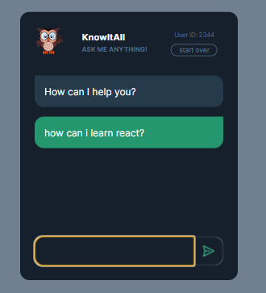

## Project: Chatbot with GPT-3
## Live Link: (https://chatbot-w-gpt-3.netlify.app/)
## Visulation of the App



## About the Project:
```bash
- User can ask anything the chatbot.
- Previous conversations are listed when user reloads the page
- User can clear all conversations clicking "start over" button
```

## Using Technologies 💻
```bash
- JavaScript
- HTML/CSS
- Bundler as vite.js
- OpenAI API Key
- GPT-3 model called as gpt-3.5-turbo
- Presence and frequency penalties
- Storing the conversation using Realtime Firebase DB
```

## Quick start:

```
$ npm install
$ npm start
````

## !Important Note: 
If you run the project you can meet 429 error status code because OpenAI API Key is not working, please create new secret key using (https://platform.openai.com/account/api-keys) website.
